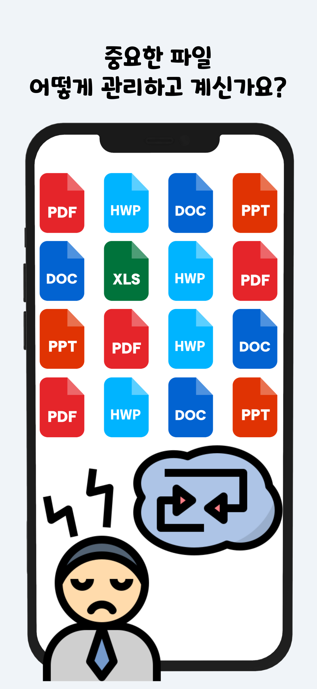
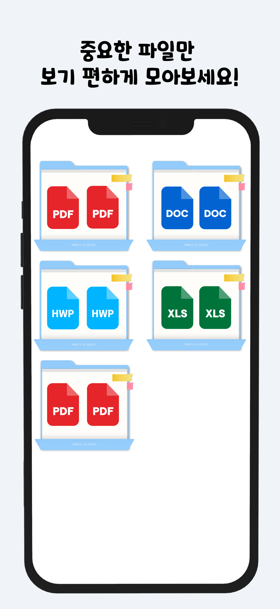
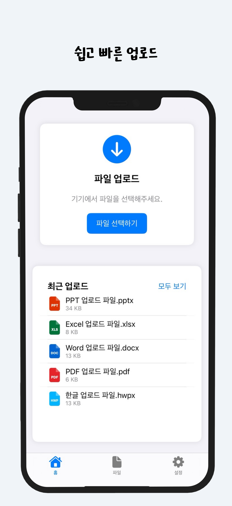
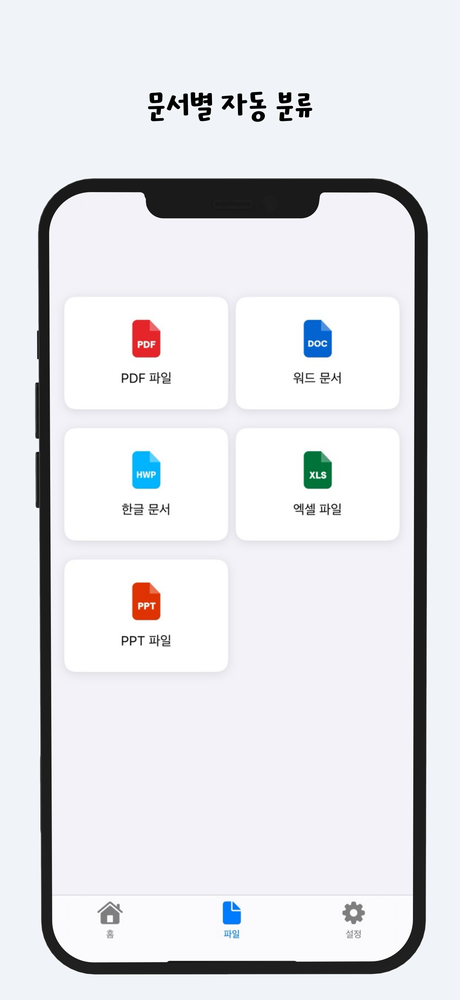

# File Organizer

파일을 종류별로 자동 정리해주는 Ios 앱입니다.

## 📌 주요 기능

- 파일 자동 분류 및 정리 시스템
- 파일 종류별 관리 (PDF, 워드, 한글, 엑셀, PPT 등)
- 드래그 앤 드롭으로 간편한 파일 업로드
- 최근 업로드된 파일 빠른 접근
- 파일 상세 정보 확인 및 미리보기
- 폴더별 파일 구조 확인
- 다크모드/라이트모드 지원
- 사용자 맞춤 설정

## 🛠 개발 환경

- **Language**: Swift
- **Framework**: SwiftUI
- **IDE**: Xcode 16.0+

## 📱 스크린샷

<p float="left">
  
  
  
  
</p>

## 🔍 현재 구현된 기능

- [x] 기본 UI 구조 구현
- [x] 파일 타입별 메뉴 구현
- [x] 탭 기반 네비게이션
- [x] 파일 업로드 기능
- [x] 파일 미리보기 기능
- [x] 최근 업로드 파일 보기
- [x] 폴더 구조 보기
- [x] 파일 상세 정보 표시
- [x] 다크모드/라이트모드 지원
- [x] 파일 자동 분류 기능 개선
- [x] 검색 기능 구현
- [ ] 파일 공유 기능

## 🚀 설치 방법

1. 저장소 클론
```bash
git clone https://github.com/YOUR_USERNAME/File-Organizer.git
```

2. Xcode로 프로젝트 열기
3. Build 및 실행

## 📂 프로젝트 구조
```
File Organizer/
├── App/
│ ├── File_OrganizerApp.swift
│ └── File_Organizer.entitlements
│
├── Core/
│ ├── Main/
│ │ └── Views/
│ │ └── MainView.swift
│ │
│ ├── Files/
│ │ ├── Views/
│ │ │ ├── FileView.swift
│ │ │ ├── FileDetailView.swift
│ │ │ ├── AllShowFileView.swift
│ │ │ └── ShowFileFolder.swift
│ │ │
│ │ └── Functions/
│ │ └── FileUpLoadFunction.swift
│ │
│ ├── Upload/
│ │ ├── FileUpLoadView.swift
│ │ └── RecentUpLoadView.swift
│ │
│ └── Settings/
│ └── SettingsView.swift
│
├── Utils/
│ └── Helpers/
│ └── ColorTheme.swift
│
├── Resources/
│ └── Assets.xcassets/
│
└── Preview Content/
└── Preview Assets.xcassets
```
